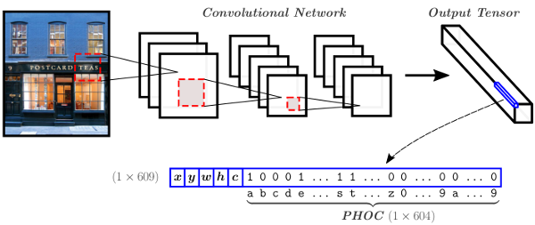

# SingleShotSTR

**Single Shot Scene Text Retrieval**, ECCV 2018.

L. Gomez*, A. Mafla*, M. Rusiñol, D. Karatzas.

In this paper we address the problem of scene text retrieval: given a text query, the system must return all images containing the queried text. The novelty of the proposed model consists in the usage of a single shot CNN architecture that predicts at the same time bounding boxes and a compact text representation of the words in them. In this way, the text based image retrieval task can be casted as a simple nearest neighbor search of the query text representation over the outputs of the CNN over the entire image database.



Our Convolutional Neural Network predicts at the same time bounding box coordinates (x,y,w,h), an objectness score c, and a pyramidal histogram of characters (PHOC) of the word in each bounding box.

If you make use of the code in this repository for scientific purposes, we appreciate it if you cite our paper:

```
@inproceedings{GomezMaflaECCV2018single,
  title     = {Single Shot Scene Text Retrieval},
  author    = {Lluis Gomez, Andres Mafla, Marçal Rusiñol, and Dimosthenis Karatzas},
  booktitle = {ECCV},
  year      = {2018}
}
```

## Dependencies

[Tensorflow](https://www.tensorflow.org/) >= 1.0.1 (tested with 1.0.1 and 1.4.0)

Numpy, Sklearn, Scipy, ...

### cphoc

A C program to build PHOC descriptors of the query strings. The cphoc library must be compiled as follows:

```
cd single-shot-str/cphoc/
gcc -c -fPIC `python-config --cflags` cphoc.c
gcc -shared -o cphoc.so cphoc.o `python-config --ldflags`
```

## Pretrained model

Download the following files and place them into the ``ckpt/`` folder:

[yolo-phoc_175800.ckpt.data-00000-of-00001](https://drive.google.com/open?id=1L0NCJP52q_hLMcYIxJJV9FvZo9XC9-bT)

[yolo-phoc_175800.ckpt.index](https://drive.google.com/open?id=1nI0Z4PSG9YZQrcjfly7xMbuNns_gPGat)

## Experiments

The ``eval_STR.py`` script reproduces the results of the experiments in our paper with the IIIT\_STR and Sports10K datasets.

### Set up data

Download and uncompress the datasets into the ``datasets/`` folder. Follow the specific instructions provided in: [datasets/README.md](datasets/README.md)

Once you have downloaded the data and pretrained model, you can just run the script:

```
python eval_STR.py
```

The script will calculate the mean Average Precision for the given dataset and save the top10 results for each query in a json file.

There some parameters that you may need to change at the begining of the ``eval_STR.py`` script:

```
    img_shape    = (608, 608, 3)
    num_priors   = 13
    phoc_size    = 604
    weights_path = './ckpt/yolo-phoc_175800.ckpt'
    thresh       = 0.002
    n_neighbors  = 10000
    gt_data_path = './datasets/IIIT_STR_V1.0/data.mat' # uses GT format of IIIT_STR & Sports10K datasets
    inp_path     = './datasets/IIIT_STR_V1.0/imgDatabase/'
```

